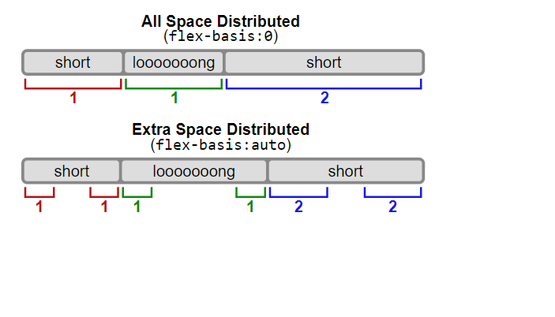

1. Introduce Flex
   1. What is flexbox? Flexbox allows you to essentially easily align elements on a single axis.
   2. Although you can align elements on a single axis **flex** has 2 imaginary axes. **The MAIN AXIS** (horizontal by default) and the **CROSS AXIS** (vertical by default)
1. Start writing flex `display:flex`

## PROPERTIES FOR THE PARENT CONTAINER

1. Talk about `Justify Content` (controls the `MAIN AXIS`) and `align-items` (controls the `CROSS AXIS`)

   1. Justify-content:
      1. `flex-start:` Items align to the start of the container.
      2. `flex-end:` Items align to the end of the container.
      3. `center:` Items align at the center of the container.
      4. `space-between:` Items display with equal spacing between them, with the first item aligned to the start and the last item aligned to the end.
      5. `space-around:` Items display with equal spacing around them, distributing space evenly so that there is half as much space before the first item and after the last item as between items.
      6. `space-evenly:` Items display with equal spacing around them, distributing space evenly so that there is an equal amount of space between each item, as well as before the first and after the last item.
         
   2. Align-items:
      1. **flex-start**: Items align to the start of the cross axis of the container.
      2. **flex-end**: Items align to the end of the cross axis of the container.
      3. **center**: Items align at the center of the cross axis of the container.
      4. **baseline**: Items align at their baselines.
      5. **stretch**: Items are stretched to fill the container along the cross axis.

1. changing `flex-direction` swaps the axes (key concept)
2. `flex-wrap`: By default flex will try and fit everything in one line. You can change that to allow items to wrap as needed. e.g. overflowing content.
   1. Talk about `reverse-wrap`
   2. When wrapping is enabled you can use **`align-content`**. This will align the flex containers lines within when there is extra space in the `CROSS-AXIS` similar to how justify content aligns individual items within the `MAIN axis`
      1. `normal` (default): items are packed in their default position as if no value was set.
      2. `flex-start` / `start`: items packed to the start of the container. The (more supported) flex-start honors the flex-direction while start honors the writing-mode direction.
      3. `flex-end` / `end`: items packed to the end of the container. The (more support) flex-end honors the flex-direction while end honors the writing-mode direction.
      4. `center`: items centered in the container
      5. `space-between`: items evenly distributed; the first line is at the start of the container while the last one is at the end
      6. `space-around`: items evenly distributed with equal space around each line
      7. `space-evenly`: items are evenly distributed with equal space around them
      8. `stretch`: lines stretch to take up the remaining space 2.`GAP`
      9. `row-gap`: sets spacing between items vertically
      10. `column-gap`: sets spacing between items horizontally
          

## PROPERTIES FOR THE CHILDREN WITHIN THE PARENT

1. `flex-grow`:
   1. Adds the ability to expand the element to fill up the empty space within the parent
   2. It accepts a unitless value. e.g. 1, 2 , 3
   3. The bigger the value the more space it can take compared to other values
2. `flex-shrink`:

   1. Defines the ability for a flex items to shrink if necessary. Similar to flex-grow if a element is a 3 and the rest are 1 it will shrink 3 times faster than the rest

3. `flex-basis`:
   1. Sets the default size of a element before remaining space is distributed. Overwrites height or width.
   2. 
4. `flex:` shorthand `flex-grow | flex-shrink | flex-basis`
5. `align-self` - Overrides align-items for the specific child element selected.
6. `order`: By default the order of the elements are by how they are ordered in the HTML. However with flex you can override this using the `order` property.
